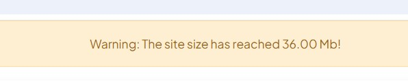

Here’s an extended version of your `README.md` file with the installation, setup instructions, and a placeholder for a screenshot:

---

# Django Place Monitor

This Django app is designed to monitor the available disk space on the server hosting your web application. When free space reaches a specified threshold, the app sends notifications to the administrator, alerting them of potential issues due to low disk space.

## 1. Installation

To install the Place Monitor Django app, follow these steps:

1. Clone the repository from GitHub:

    ```bash
    git clone https://github.com/777liza/place_monitor_django.git
    ```

2. Navigate to your project folder and install the dependencies:

    ```bash
    cd place_monitor_django
    pip install -r requirements.txt
    ```

3. Add the app to your `INSTALLED_APPS` in your project's `settings.py` file:

    ```python
    INSTALLED_APPS = [
        ...
        'place_monitor_django',  # Add this line
    ]
    ```

4. Run migrations:

    ```bash
    python manage.py migrate
    ```

## 2. Configuration

### Middleware

To activate the Place Monitor middleware that checks the server disk space and sends alerts to administrators, add the following to the `MIDDLEWARE` section of your `settings.py`:

```python
MIDDLEWARE = [
    ...
    'place_monitor_django.middleware.AdminMessageMiddleware',
]
```

### Size and Email Settings

Define the maximum site size and email sending intervals in your `settings.py`:

```python
# Site size threshold for sending alerts (in bytes)
MAX_SITE_SIZE = 10 * 1024 * 1024  # 10 MB

# Time interval between email alerts (in seconds)
EMAIL_SEND_INTERVAL = 12 * 60 * 60  # 12 hours
```

### Email Configuration

Configure your email backend for sending notifications when the site exceeds the size limit. Replace the placeholders below with the appropriate information for your email provider:

```python
# Email settings
EMAIL_BACKEND = 'django.core.mail.backends.smtp.EmailBackend'
EMAIL_HOST = 'smtp.example.com'
EMAIL_PORT = 587
EMAIL_USE_TLS = True
EMAIL_HOST_USER = 'your-email@example.com'
EMAIL_HOST_PASSWORD = 'your-email-password'
DEFAULT_FROM_EMAIL = 'your-email@example.com'

# Admin email for receiving notifications
ADMIN_EMAIL = 'admin-email@example.com'
```

Additionally, set the `ADMINS` tuple to include admin contact information:

```python
ADMINS = [
    ('Admin Name', 'admin-email@example.com'),
]
```
## 3. Feature
| Feature | Status | Description |
|---|---|---|
| Directory Fullness Warning | ✅ Done | The system successfully tracks directory usage and displays notifications when a certain threshold is reached. |
| Email Notification to Administrator | In development | Development of a module for email messages to the administrator. |

## 4. Screenshot



---

With this structure, your `README.md` will provide clear steps for installation and configuration, making it easier for users to set up and run the Place Monitor Django app. Make sure to replace placeholder email details with actual information for proper email configuration.
